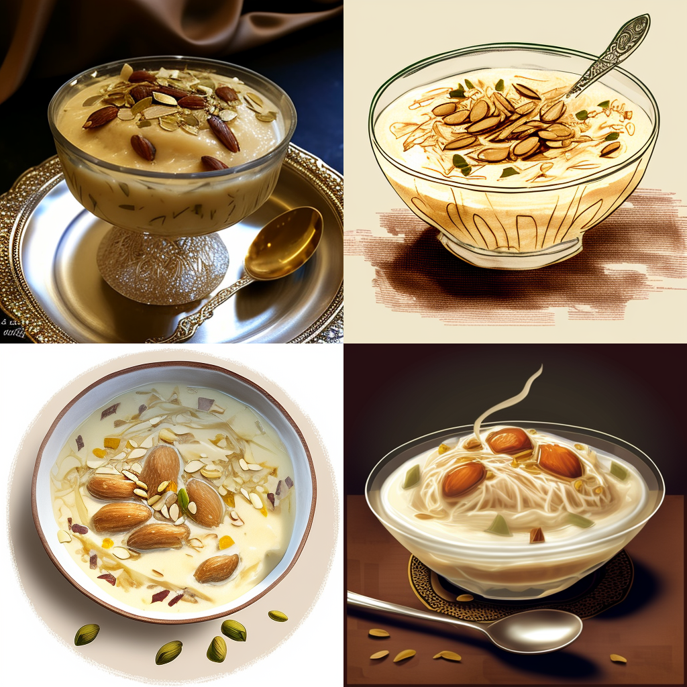
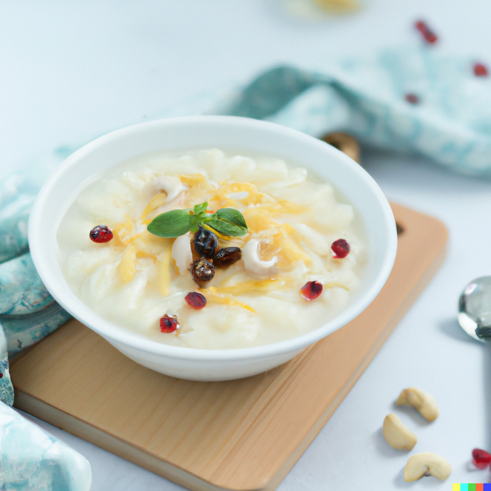
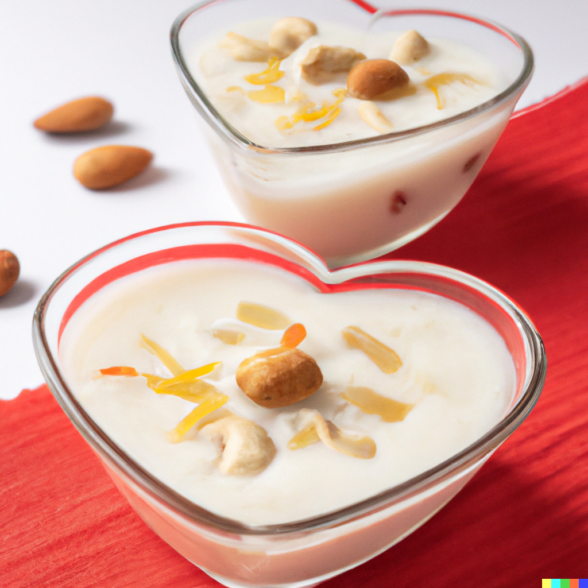
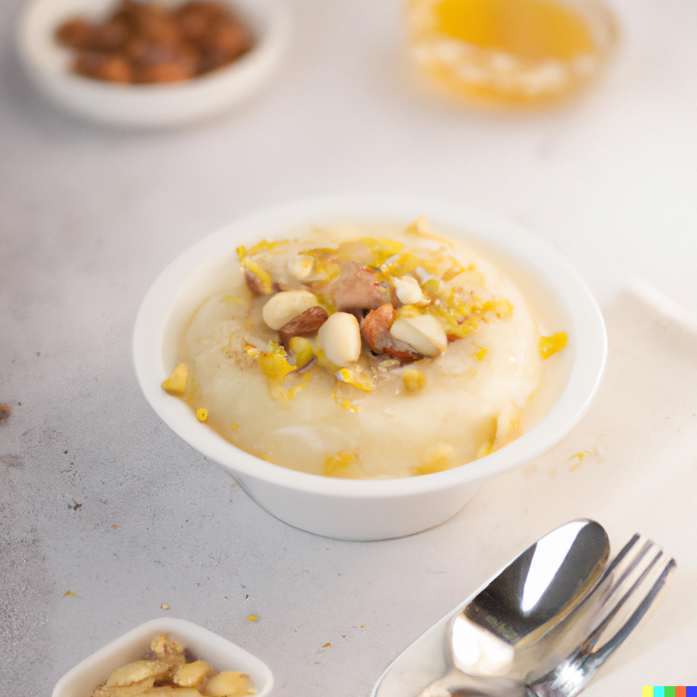
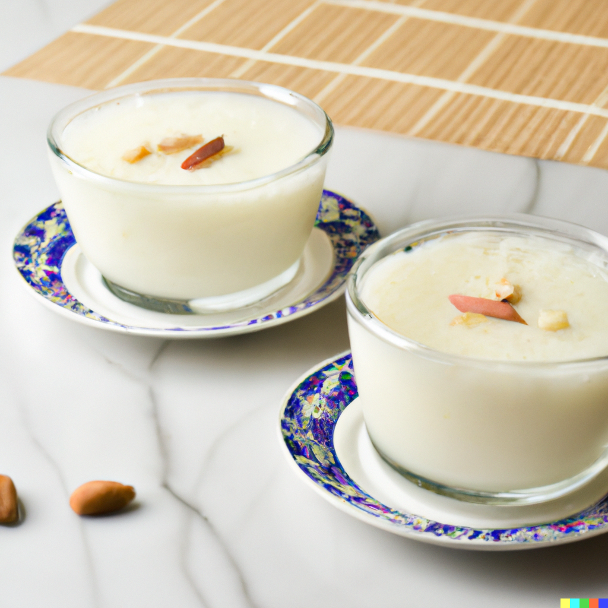

# AI Generated

I used [Chat-GPT](https://chat.openai.com/chat), [Midjourney](https://www.midjourney.com/home/?callbackUrl=%2Fapp%2F) and [DALL-E](https://labs.openai.com/) to see if an AI could generate recipes and images to match said recipe title. At some point in this journey I would like to try each recipe out to gauge just how accurate these Generative AI tools are with generating recipe data.

# Chat-GPT
## Beginner Recipes
> Prompt: Generate a list of recipe ideas for someone who is a beginner to baking or cooking in general

Response:
        
    Sure, here are some recipe ideas for someone who is new to baking or cooking:

    1. Chocolate chip cookies
    2. Brownies
    3. Banana bread
    4. Omelette
    5. Pancakes
    6. Fried rice
    7. Pasta with tomato sauce
    8. Chicken stir-fry
    9. Baked chicken breast
    10. Mashed potatoes
    11. Vegetable soup
    12. Grilled cheese sandwich
    13. Quesadillas
    14. Tacos
    15. Fruit smoothie
    16. Greek salad
    17. Roasted vegetables
    18. Garlic bread
    19. Apple crisp
    20. Rice pudding
    
    These recipes are easy to follow and use simple ingredients, making them perfect for beginners to baking and cooking. Good luck and have fun in the kitchen!

## Intermediate Level Recipes
> Prompt: Generate a list of recipe ideas for someone who is has an intermediate level of baking or cooking skills

Response:

    Sure, here are some recipe ideas for someone who has an intermediate level of baking or cooking skills:

    1. Homemade pizza
    2. Beef stroganoff
    3. Lasagna
    4. Chicken parmesan
    5. Sushi rolls
    6. Baked salmon
    7. Thai curry
    8. Spinach and feta stuffed chicken breasts
    9. Grilled steak
    10. Quiche Lorraine
    11. Beef or vegetable pot pie
    12. Coq au Vin
    13. Ratatouille
    14. Risotto
    15. Beef or vegetable stir-fry
    16. Gnocchi with pesto sauce
    17. Crab cakes
    18. Falafel
    19. Beef or vegetable kabobs
    20. Tiramisu
    
    These recipes require some intermediate level skills, such as working with yeast, using a variety of cooking techniques, and following slightly more complex recipes. However, with practice and patience, anyone can master these delicious dishes!

## Advanced Recipes
> Prompt: Generate a list of recipe ideas for someone who is has an advanced level of baking or cooking skills

Response:

    Sure, here are some recipe ideas for someone who has an advanced level of baking or cooking skills:

    1. Beef Wellington
    2. Lobster Thermidor
    3. Duck confit
    4. Beef bourguignon
    5. Beef Carpaccio
    6. Rack of lamb
    7. Paella
    8. Beef tartare
    9. Bouillabaisse
    10. Tandoori chicken
    11. Soufflé
    12. Beef short ribs
    13. Osso buco
    14. Baked Alaska
    15. Croquembouche
    16. Sourdough bread
    17. Creme Brulee
    18. Truffles
    19. Macarons
    20. Choux pastry
    
    These recipes require advanced level skills and techniques such as tempering chocolate, making pastry dough from scratch, working with advanced knife techniques, and cooking with precision temperature control. They can be challenging, but the results are often worth the effort, creating truly impressive and delicious dishes.

## Mastery Level Recipes
> Prompt: Generate a list of recipe ideas for someone who is has mastery of baking or cooking

Response:
    
    Sure, here are some recipe ideas for someone who has mastery of baking or cooking:

    1. Molecular gastronomy dishes, such as foams, gels, and powders
    2. Charcuterie, such as homemade prosciutto or sausages
    3. Smoked meats and fish, such as homemade smoked salmon or brisket
    4. Artisanal cheeses, such as aged cheddar or brie
    5. Multi-course tasting menus with wine pairings
    6. Molecular cocktails, such as smoke-infused drinks or liquid nitrogen cocktails
    7. Fruit or vegetable sculptures
    8. Specialized cuisine, such as Japanese kaiseki or French nouvelle cuisine
    9. Homemade pasta, such as fettuccine or tortellini
    10. Wood-fired pizza with homemade dough and fresh toppings
    11. Roasted or grilled whole animal, such as lamb or pig
    12. Handmade bread, such as sourdough or ciabatta
    13. Homemade ice cream, gelato or sorbet with unique flavor combinations
    14. Specialty baking, such as wedding cakes or French patisserie
    15. Molecular desserts, such as edible bubbles or nitrogen-frozen treats.

    These recipes require mastery of advanced skills and techniques, such as sous-vide cooking, fermentation, and advanced pastry work. They often involve high-end ingredients and equipment, and take time and dedication to execute perfectly. However, the results are truly impressive, and showcase the pinnacle of culinary artistry.

## Top Dishes by Country
> Prompt: Can you list the top most loved recipe for each country

Response:

    Sure, here are some of the most loved and traditional dishes from different countries around the world:

    Italy: Pizza Margherita
    Japan: Sushi
    Mexico: Tacos al Pastor
    India: Chicken Tikka Masala
    Thailand: Pad Thai
    Spain: Paella
    France: Coq au Vin
    United States: Hamburger
    China: Kung Pao Chicken
    Greece: Moussaka
    Brazil: Feijoada
    Lebanon: Falafel
    South Africa: Bobotie
    Jamaica: Jerk Chicken
    Vietnam: Pho
    Argentina: Asado (Grilled Meat)
    Turkey: Kebab
    Morocco: Couscous
    Peru: Ceviche
    Germany: Schnitzel

    Please note that this list is not exhaustive, and there are many other beloved dishes from these and other countries.

## Rarely Known Dishes by Country
> Prompt: Rarely known dishes or recipes per country

Response:

    Sure, I can provide you with some rarely known dishes or recipes per country. However, please keep in mind that these are just a few examples and not an exhaustive list, as every country has a vast range of unique and delicious dishes.

    Here are some rarely known dishes or recipes per country:

    Bolivia - Silpancho: A traditional Bolivian dish made with flattened rice, beef, onions, tomatoes, chili pepper, and fried potatoes.

    Cameroon - Ndolé: A stew made with bitter leaves, nuts, and meat or fish. It is considered the national dish of Cameroon.

    Denmark - Stegt flæsk med persillesovs: A dish consisting of crispy pork belly served with parsley sauce and boiled potatoes.

    Estonia - Kama: A traditional Estonian dish made from a mixture of roasted barley, rye, oat, and pea flour. It is typically served as a breakfast cereal or dessert.

    Ghana - Red-red: A popular Ghanaian dish made with black-eyed peas, palm oil, and fried plantains.

    Honduras - Sopa de Caracol: A traditional Honduran soup made with conch, vegetables, coconut milk, and spices.

    Iran - Ghormeh sabzi: A Persian stew made with herbs, kidney beans, and lamb or beef.

    Jamaica - Escovitch fish: A Jamaican dish made with fried fish, vinegar, vegetables, and spicy pepper sauce.

    Kazakhstan - Beshbarmak: A traditional Kazakh dish made with boiled meat (usually lamb or beef) served with flat noodles and onion sauce.

    Laos - Laap: A Laotian dish made with minced meat, herbs, and spices. It can be served as a salad or a main dish.

    Morocco - Pastilla: A Moroccan dish consisting of layers of flaky pastry, meat, and spices, topped with cinnamon and powdered sugar.

    Nepal - Sel roti: A traditional Nepalese snack made from rice flour and sugar, shaped like a donut and deep-fried.

    Peru - Lomo saltado: A Peruvian dish made with beef, onions, tomatoes, and french fries, served with rice.

    Romania - Sarmale: A traditional Romanian dish made with minced meat and rice wrapped in cabbage or grape leaves and cooked in a tomato sauce.

    Sri Lanka - Kottu roti: A Sri Lankan dish made with shredded roti, vegetables, and spices. It can be served with chicken or seafood.

    I hope this list gives you some inspiration to explore new and exciting dishes from around the world!

## Suggest a recipe suitable for Eid
> Prompt: Can you suggest a good recipe for someone celebrating Eid Murbarak with UK measurements and nutritional information

Response:

    Sure, here's a recipe for Sheer Khurma (Vermicelli Pudding) with UK measurements and nutritional information:

    Ingredients:

    200g vermicelli
    1 litre full-fat milk
    200ml condensed milk
    2 tbsp ghee (clarified butter)
    1/2 cup mixed dry fruits (almonds, pistachios, cashews, raisins)
    1/4 tsp green cardamom powder
    1/4 tsp saffron strands
    2-3 tbsp sugar (optional)
    Silver leaf for garnish (optional)
    
    Instructions:

    1. Heat the ghee in a deep, heavy-bottomed pot over medium heat. Add the vermicelli and fry until golden brown.
    2. Add the milk and condensed milk to the pot and stir well.
    3. Add the green cardamom powder and saffron strands. Stir to combine.
    4. Bring the mixture to a boil, then reduce the heat to low and let it simmer for 15-20 minutes or until the vermicelli is cooked through and the pudding has thickened.
    5. Add the mixed dry fruits and sugar (if using). Stir to combine.
    6. Remove from heat and let the sheer khurma cool for a few minutes.
    7. Garnish with silver leaf (if using) and serve warm or chilled.
    
    Nutritional information (per serving):

    Calories: 296
    Total Fat: 14g
    Saturated Fat: 7g
    Cholesterol: 36mg
    Sodium: 98mg
    Total Carbohydrate: 36g
    Dietary Fiber: 1g
    Sugars: 23g
    Protein: 8g
    Sheer Khurma is a traditional dessert that is often served during Eid. It's a rich and creamy pudding made with vermicelli, milk, condensed milk, and mixed dry fruits. The addition of saffron and green cardamom powder gives it a fragrant and aromatic flavour.

---
# Midjourney

Midjourney will generate four images from the prompt, downloadable as a single file.

## Sheer Khurma realistic image generation
> Prompt: realistic Sheer Khurma aka Vermicelli Pudding, a celebratory dessert eaten during Eid

Response:

--- 
# DALL-E

DALL-E will generate four images from the prompt, each individually downloadable.

## Sheer Khurma realistic image generation
> Prompt: realistic Sheer Khurma aka Vermicelli Pudding, a celebratory dessert eaten during Eid

Response:

--- 

Notes on findings:
- Responses by DALL-E are more realistic than Midjourney.